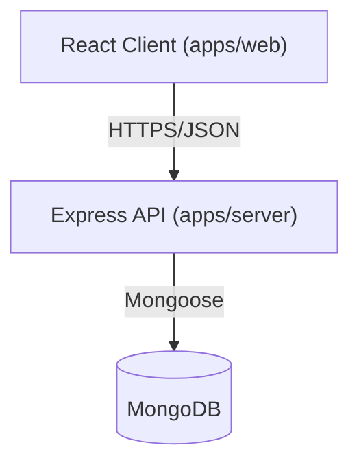

# Architecture Overview

## 1. System Design

AgroNond follows a classic Client-Server architecture.



### Key Components

*   **Client**: Single Page Application (SPA) built with React and Vite. Handles all UI/UX, state management (React Query + Context), and routing.
*   **Server**: RESTful API built with Express. Handles business logic, authentication, data validation, and database interactions.
*   **Database**: MongoDB. Stores users, agricultural records, and daily rates. Schema enforcement via Mongoose.

## 2. Directory Structure

The project is organized as a Monorepo.

```
AgroNond/
├── apps/
│   ├── web/                # Frontend Application
│   │   ├── src/
│   │   │   ├── components/ # Reusable UI & Logic components
│   │   │   │   ├── ui/         # Dumb UI (Buttons, Cards)
│   │   │   │   ├── layout/     # Layouts (Navbar, Sidebar)
│   │   │   │   ├── navigation/ # Role-based Navbars
│   │   │   │   └── auth/       # Auth guards
│   │   │   ├── pages/      # Route Pages (Dashboard, Public)
│   │   │   │   ├── farmer/     # Farmer specific pages
│   │   │   │   ├── trader/     # Trader specific pages
│   │   │   │   └── ...
│   │   │   ├── context/    # Global State (AuthContext)
│   │   │   └── lib/        # Utilities (API helpers)
│   │   └── ...
│   │
│   ├── server/             # Backend Application
│   │   ├── src/
│   │   │   ├── models/     # Mongoose Models (User, Record)
│   │   │   ├── routes/     # API Route Definitions
│   │   │   ├── middleware/ # Auth & Error Middleware
│   │   │   └── config/     # DB Connection
│   │   └── ...
│   │
│   └── mobile/             # React Native App (Future)
│
├── docs/                   # Documentation
└── package.json            # Root configuration
```

## 3. Key Workflows

### A. Record Lifecycle
The core data entity is the **Record**, representing a batch of produce.

1.  **Creation (Pending)**: Farmer uploads a record (Vegetable + Approx Qty).
2.  **Verification (Weighed)**: Weight Staff verifies the actual weight (`official_qty`).
3.  **Sale (Completed)**: Trader/Lilav Staff assigns a price (`sale_rate`) and buyer (`trader_id`).
4.  **Payment**: Status is tracked as `Payment Pending` -> `Paid`.

### B. Authentication
*   **Method**: Phone Number + OTP (Simulated dev OTP or real SMS provider).
*   **Session**: JWT (JSON Web Token) stored in localStorage/cookies.
*   **Protection**: `requireAuth` middleware on server, `ProtectedRoute` wrapper on client.

## 4. Security Principles
*   **RBAC**: All sensitive routes check `req.user.role`.
*   **Validation**: Inputs validated before DB insertion.
*   **Sanitization**: MongoDB injection protection via Mongoose.
*   **Environment**: Secrets managed via `.env` files (not committed).
