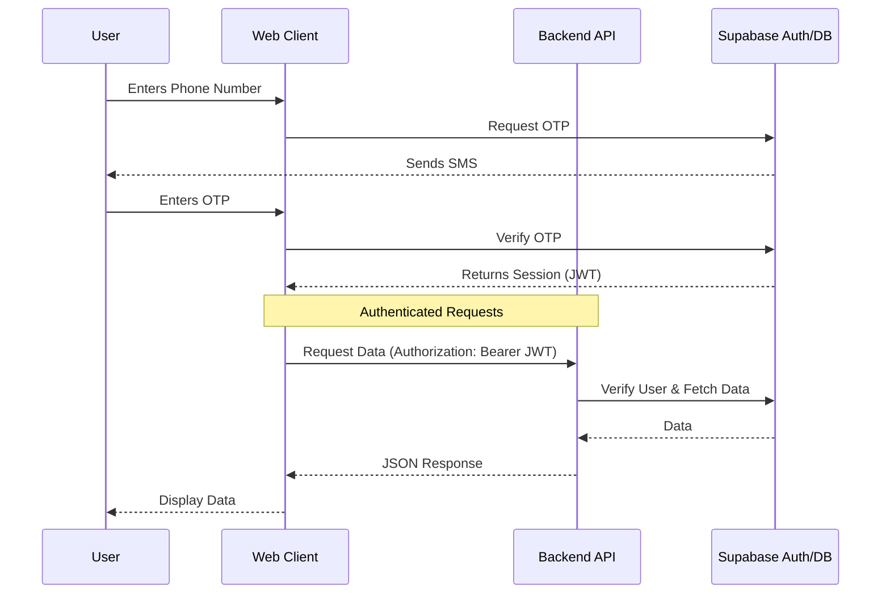

# System Architecture

AgroNond follows a modern web architecture separating the frontend client, backend API, and database services.

## Monorepo Structure

The project is organized as a monorepo in the `apps/` directory:

```
AgroNond/
├── apps/
│   ├── web/           # React Frontend Client
│   ├── server/        # Express Backend API
│   └── mobile/        # React Native Mobile App (Expo)
└── docs/              # Project Documentation
```

## 1. Frontend Client (`apps/web`)

Built with **React 19** and **Vite**, focusing on performance and user experience.

- **Routing**: `react-router-dom` with protected route guards.
- **State Management**: Context API (`AuthContext` for user session).
- **Styling**: TailwindCSS for rapid, responsive UI development.
- **Auth**: `@supabase/supabase-js` client for direct authentication.

## 2. Backend Server (`apps/server`)

Built with **Express.js**, acting as a middleware and business logic layer.

- **Role**: Handles complex business logic, admin operations, and data aggregation that shouldn't be exposed to the client.
- **Auth**: Verifies JWT tokens from the frontend using Supabase Admin SDK.
- **Security**: Uses `supabase-admin` (Service Role) to bypass RLS when necessary for system operations.

## 3. Database Services (Supabase)

We use **Supabase** as our backend-as-a-service provider.

- **PostgreSQL**: The core relational database.
- **Authentication**: Handles user identity (Phone/OTP).
- **Row Level Security (RLS)**: Policies enforced at the database level to ensure users can only access their own data.

### Data Flow


